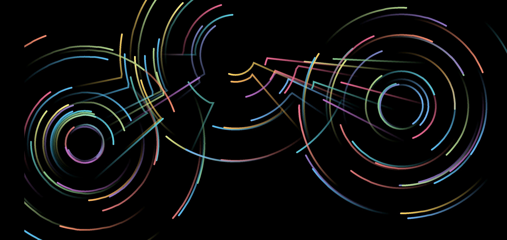

# Flow

A purely visual Android application which is built on the idea of having particles guided by a perlin noise field and is
 inspired by Dan Shiffman's video: https://www.youtube.com/watch?v=BjoM9oKOAKY

This app is developed (and therefore has only been tested) on an API28 device

## License

This project is released as open source under the [MIT License](https://opensource.org/licenses/MIT)